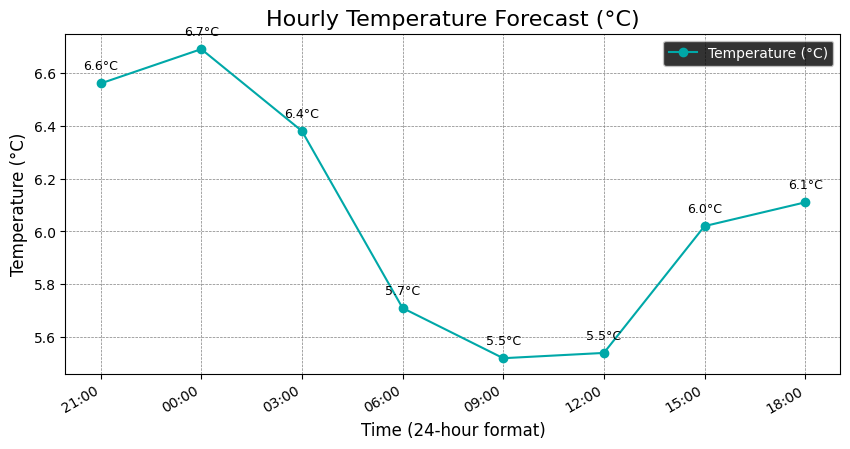

# New Features: Forecast Graph and Share Button

This document outlines the new features added to the Weather Dashboard application.

## 1. Forecast Graph

A graph showing the hourly temperature forecast has been added to the "24-Hour Forecast" section. This provides a visual representation of the temperature variations over the next 24 hours.

### Implementation Details

- **Backend:**
    - The `matplotlib` library is used to generate the graph.
    - A new function, `generate_plot`, has been added to `app.py`. This function takes the hourly forecast data and generates a line plot of temperature versus time.
    - The generated plot is saved as a PNG image in the `static` directory.
- **Frontend:**
    - The `index.html` template has been updated to display the generated graph.
    - The graph is displayed only when weather data is available.

## 2. Share Button

A share button has been added to the top right corner of the page. This allows users to share the current weather forecast with others.

### Implementation Details

- **Frontend:**
    - A share button has been added to the `index.html` template.
    - JavaScript is used to handle the click event of the share button.
    - The Web Share API is used to open the native share dialog on supported devices.
    - If the Web Share API is not supported, an alert is displayed.

## How to Run the Application

1.  **Install the dependencies:**
    ```bash
    pip install -r requirements.txt
    ```
2.  **Run the application:**
    ```bash
    python app.py
    ```
3.  Open your web browser and go to `http://127.0.0.1:5000`.

## Screenshots

### Forecast Graph


### Share Button
 <!-- Please replace with a real screenshot -->
